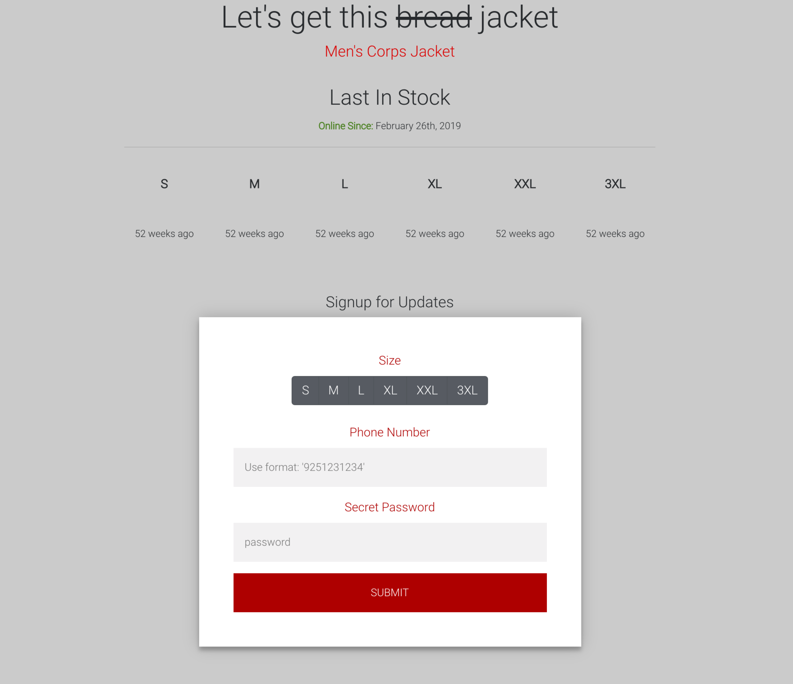

# 👕 CoatCheck

#### A cloud merchandise stock checker and notification service. 

## Part 0: The Problem
I had just started at Tesla. The environment was new, and the projects were exciting. There was a long list of onboarding tasks but there was one clear task every tech bro wants to do when they start a new job -- GET THE COMPANY MERCH. 

Specifically, everyone had their eyes on one special jacket that has seen many interviews and public events, donned by our CEO (Figure 1), and regarded as the “coolest company jacket in the [silicon] valley” (As heard on a Recode Decode podcast .. probably)

Figure 1: Elon Musk, CEO of Tesla, wearing the aforementioned Tesla jacket

Unfortunately, we were not the only ones who thought this way. Not only did many employees buy this jacket, our online merch store was also open to the public. The jacket was out of stock in every size. We checked periodically and every now a size or two would come back in stock but in very limited quantities. One day, over a weekend, all the sizes restocked. There was no automatic way of checking this, and we relied on our manual site visits to check if it would be available. Unlucky for us, when we found out about this and checked on Monday, it had once again sold out. It was at this point that I decided: We are not missing another restock.

## Part 1: The Script
I needed to figure out a way to automatically check the stock and notify me. I decided to take a look at the online shop’s API calls when it rendered the product page, and bingo: __they had a call that returned all the shop information in JSON__. I decided to create a python script that would make GET requests to this endpoint every minute. I integrated the Twilio API to allow for the script to text me the stock information immediately whenever the jacket came back in stock. I ran this on my local machine 24/7 and waited for my notification! During this waiting period, I told a few other interns about this little script and I slowly gained a list of 10 people who would be waiting on this notification. As the list grew bigger, I didn’t want to keep manually adding new phone numbers to an array in the program so I expanded my script to host a Flask web server. The main purpose of this was to use an endpoint which would be called when new users would text my Twilio number for signup, automating the saving of contact information. I also spun up a MongoDB server to store the information. 

## Part 2: The Scale 
A couple weeks have passed since I’ve started creating the script and there was still no restock. By now, the word has gotten out that I’ve created a program. At this point, there were ~20 people that are now depending on me to make sure they get the notification of when to buy this product. The number was steadily growing and I knew that a script on my local machine was not fault tolerant or scalable. The original script was written in a while loop and would run forever. Any type of error from the script would bring it down. Secondly, it was also a big inconvenience to run my computer for 24 hours a day. Time to scale up the operation. 

I decided to deploy this service on Google Cloud Platform. I made this decision after reading about using a pub/sub architecture to effectively manage cloud tasks. On the platform, I used their managed cron executor (Cloud Scheduler) to publish messages every minute to a topic. This guaranteed that cron execution would always be consistent (granted GCP was not down) and would always call my script on time. I had a consumer listening for messages in the topic to prompt my script. The consumer and the script were hosted on micro-VMs (containers) and multiple instances could be spun up for redundancy. I migrated the DB server to a managed MongoDB cloud instance to also leverage cloud availability and also began saving historical stock data in my DB every minute. Another side benefit of using cloud instances was that when my instances would scale up and all try to hit the database, but the DB service would provide the appropriate locks and semaphores to not allow reads where writes were happening. 

Through all these changes, I also decided to add functionality to the core service. I set up another instance to host my Flask web server and put up a small site to allow for users to sign up online in addition to text. This site also included a section that would use database information to display the last time each stocked time for the different styles and sizes. The script was updated to allow for sizes to be specified to be given more control over what notifications you wanted to get, and the database had an extra flag on the users object to prevent double notifications. I set up health trackers on the instances and alerts for when I would get too many errors and I wrote endpoints that would allow me to track server and script health when queried.

## Part 3: The Summary
Restock happened. My program was able to service a large number of interns, a couple full time employees, and even a senior manager! In the lifetime of the application, 300+ notifications were sent at varying times as my program was fast enough to catch specific size restocks whenever someone would return a jacket instead of waiting for the general restocks. 

I was the sole contributor on this project and the total aggregated working time from design to deployment was 40-50 hours. I manually set up all the instances, web servers and connections between all the moving parts. If I were to improve this project, I would dig deeper into the shop API (if possible) to try and implement a more native method of notifications instead of building an adapter. For the website, I would also decide to use a frontend framework like React to create a dynamic app that would update with current information without refreshing.

**Note: This project has concluded in July 2019 and is no longer required because the jackets are well stocked. There was also an API change in Aug 2019 that has contained a breaking change to this script. Because it is no longer required, it has not been maintained. RIP project but this was super fun to work on and I learned a lot!**
